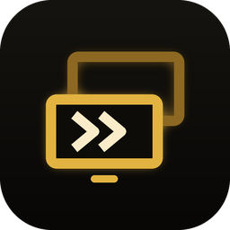

<p align="center"></p>

# Hyperlink

Fast remote desktop for your own PCs: a Windows host that streams its screens with the GPU's
video encoder, and an Android app that shows them at up to 120 fps.

## What you get

- **Smooth**: hardware encoding on the PC (NVIDIA NVENC, AMD AMF, Intel Quick Sync), hardware
  decoding on the phone, a UDP transport with forward error correction, and every step tuned
  for latency. The phone runs its display at its highest refresh rate while connected.
- **Every monitor**: see all of a PC's screens together, laid out the way they sit on the desk,
  or one at a time. Tap a screen or pick it from the toolbar to switch.
- **Separate windows**: every connection opens in its own window, so you can be connected to several
  PCs at once, or open each monitor of a PC in its own window (split screen, freeform windows, DeX).
- **Your devices, remembered**: give each PC your own name and its PIN once. The list shows whether each PC
  is online, and whether someone is already connected and streaming. PCs on your network
  appear by themselves.
- **Updates from GitHub**: both apps have an Update button (and an optional check on start) that
  installs the latest release from this repository.

## Install

1. On the PC: download `Hyperlink-Setup-<version>.exe` from [Releases](../../releases) and run it.
   It adds a firewall rule and, if you leave the box ticked, starts Hyperlink Host when you sign
   in (with admin rights, so it can also control admin windows). The first start shows the
   **PIN**. You can change the PIN and the PC's name in Settings (double-click the tray icon).
2. On the phone or tablet: download `Hyperlink-Android-<version>.apk` from the same release and
   install it (allow installs from your browser or file manager when asked).
3. Open the app. The PC shows up under **Found on your network**: tap **Add**, enter the PIN,
   save, and tap **Connect**. For a PC somewhere else, add it by address. Tailscale or another VPN
   works well; don't forward the ports on your router.

## Using it

- **Touchpad mode** (default): drag to move the pointer, tap to click, tap with two fingers to
  right-click, double-tap and drag to drag, drag with two fingers to scroll.
- **Touch mode**: tap where you want to click; long-press to right-click.
- **Three-finger tap** or the handle at the top shows the toolbar: switch screens, open a
  new window, keyboard, extra keys (Ctrl, Alt, Win, arrows, F-keys, Task Manager, …), mouse
  mode, stats, disconnect.
- A Bluetooth or USB mouse and keyboard work directly.

## For 120 fps

- The PC's monitor must run at 120 Hz or faster: Windows only produces as many desktop frames as
  the monitor shows.
- The phone needs a 120 Hz screen. Hyperlink switches it to its fastest mode while connected.
- Use 5 GHz or 6 GHz Wi-Fi or Ethernet. Turn on **Stats** in the toolbar to see frame rate,
  bitrate, latency per stage and packet loss.

## How it's built

| Part | Folder | Tech |
|---|---|---|
| Shared core | `core/` | C++17: protocol, Reed-Solomon FEC, packetizer, client connection logic, tests |
| Windows host | `host/` | C++17, DXGI Desktop Duplication, D3D11 video processor, FFmpeg (NVENC/AMF/QSV), WinHTTP |
| Android app | `android/` | Kotlin UI, NDK C++ (the core plus MediaCodec decoding to a Surface) |

Ports: TCP 47800 (control), UDP 47801 (video), UDP 47802 (discovery and status).

## Building

Everything builds on GitHub Actions (`.github/workflows/build.yml`) on every push: core tests on
Linux and Windows, the Android APK, and the Windows host with its installer.

**Releasing**: bump `VERSION`, add a `## vX.Y.Z` section to `CHANGELOG.md`, and merge to `main`.
The workflow publishes release `vX.Y.Z` with the setup program, a portable zip and the APK, and
the in-app updaters pick it up from there. (The repository has to be public for the apps to see
releases without signing in.)

Local builds:

```
# core + tests (any OS)
cmake -S . -B build && cmake --build build && ctest --test-dir build

# Windows host (Visual Studio 2022 + an FFmpeg shared build)
cmake -S . -B build -A x64 -DFFMPEG_DIR=C:/ffmpeg && cmake --build build --config Release

# Android
cd android && ./gradlew assembleRelease
```

Release APKs are signed with a private key kept in the repository secrets
(`HYPERLINK_KEYSTORE_BASE64`, `HYPERLINK_KEYSTORE_PASSWORD`, `HYPERLINK_KEY_ALIAS`,
`HYPERLINK_KEY_PASSWORD`). Keep a backup of the keystore: Android only installs an update
signed with the same key. Builds without the secrets (branches, pull requests) use a debug key.

## Hardware

The host picks the best encoder the PC has, in this order: NVIDIA NVENC, AMD AMF, Intel Quick
Sync, then software x264, so swapping graphics cards needs no settings change. The phone app asks
Android which decoders it has and uses HEVC or AV1 when both sides support it, else H.264. It
turns on the low-latency modes of Qualcomm (Snapdragon), Samsung Exynos, MediaTek and Kirin
decoders.
